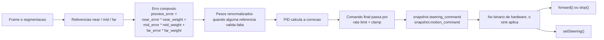

# PID Control

## Resumo

O `autonomous_car_v3` usa a segmentacao compartilhada para calcular um erro lateral composto e gerar um comando de direção suavizado no modo autonomo.

Fluxo:

1. `RoadSegmentationService` processa o frame.
2. `AutonomousControlService` combina `near`, `mid` e `far`.
3. O PID calcula a correção.
4. O comando final passa por clamp + rate limit.
5. No binario de hardware, o sink aplica `forward/stop` e `setSteering`.



## Erro composto

O erro do controlador nao usa apenas o ponto mais proximo. Ele calcula:

```text
preview_error =
  near_error * near_weight +
  mid_error  * mid_weight  +
  far_error  * far_weight
```

Regras:

- `near` e `mid` precisam ser válidos para rastreamento.
- `far` é opcional.
- quando alguma referencia valida falta, os pesos restantes sao renormalizados.
- `heading_error_rad` e `curvature_indicator_rad` entram como diagnostico e debug, nao como termo direto do atuador.

Defaults:

- `near=0.5`
- `mid=0.3`
- `far=0.2`

## Fail-safe

O modo autonomo exige `command:autonomous:start`.

Parada segura acontece quando:

- chega `command:autonomous:stop`
- o modo muda para `manual`
- a pista fica indisponivel acima de `AUTONOMOUS_LANE_LOSS_TIMEOUT_MS`
- a confianca cai abaixo de `AUTONOMOUS_MIN_CONFIDENCE` por tempo maior que a tolerancia
- o servico encerra

Comportamento:

- durante a tolerancia curta, o estado vai para `searching`
- ao exceder a tolerancia, o estado vira `fail_safe`
- o latch de `start` e desligado
- a direção volta para zero
- o movimento vira `stopped`
- nao ha retomada automatica; exige novo `command:autonomous:start`

## Parametros publicos

No arquivo `config/autonomous_car.env`:

- `AUTONOMOUS_PID_KP`
- `AUTONOMOUS_PID_KI`
- `AUTONOMOUS_PID_KD`
- `AUTONOMOUS_PID_OUTPUT_LIMIT`
- `AUTONOMOUS_PREVIEW_NEAR_WEIGHT`
- `AUTONOMOUS_PREVIEW_MID_WEIGHT`
- `AUTONOMOUS_PREVIEW_FAR_WEIGHT`
- `AUTONOMOUS_MAX_STEERING_DELTA_PER_UPDATE`
- `AUTONOMOUS_MIN_CONFIDENCE`
- `AUTONOMOUS_LANE_LOSS_TIMEOUT_MS`

## Painel local

Quando `VISION_DEBUG_WINDOW_ENABLED=true`, a janela local mostra:

- painel original da segmentacao
- estado atual: `manual`, `idle`, `searching`, `tracking` ou `fail_safe`
- erro composto e termos `P/I/D`
- comando final de direção
- seta visual de esterçamento
- mapa superior com:
  - veículo no rodapé
  - referencias `near`, `mid` e `far`
  - curva prevista a partir do comando atual

## Tuning inicial

Defaults atuais:

- `KP=0.45`
- `KI=0.02`
- `KD=0.08`
- `OUTPUT_LIMIT=0.55`
- `MAX_STEERING_DELTA_PER_UPDATE=0.08`

Procedimento recomendado:

1. Ajustar `KP` até o carro começar a corrigir sem ficar lento.
2. Aumentar `KD` para reduzir tranco e sobre-oscilaçao.
3. Só então subir `KI` se sobrar erro lateral persistente.
4. Limitar `OUTPUT_LIMIT` e `MAX_STEERING_DELTA_PER_UPDATE` para manter curva suave.
