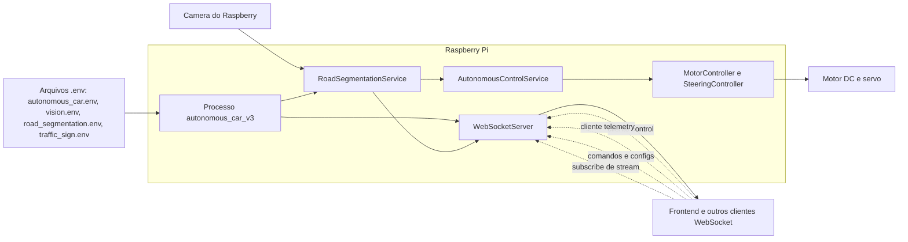
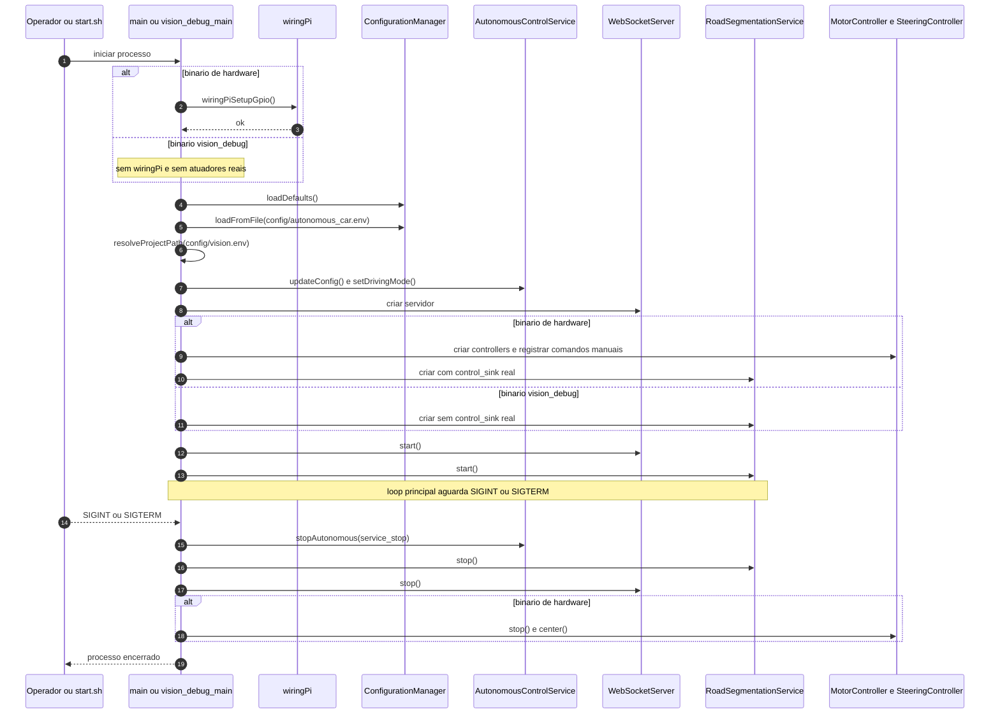
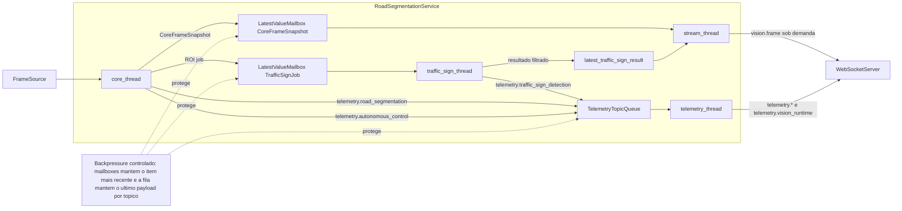
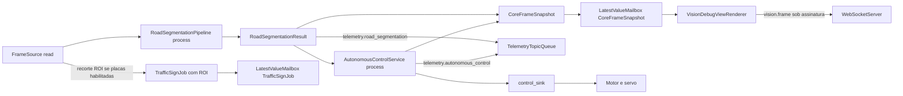
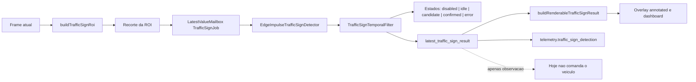
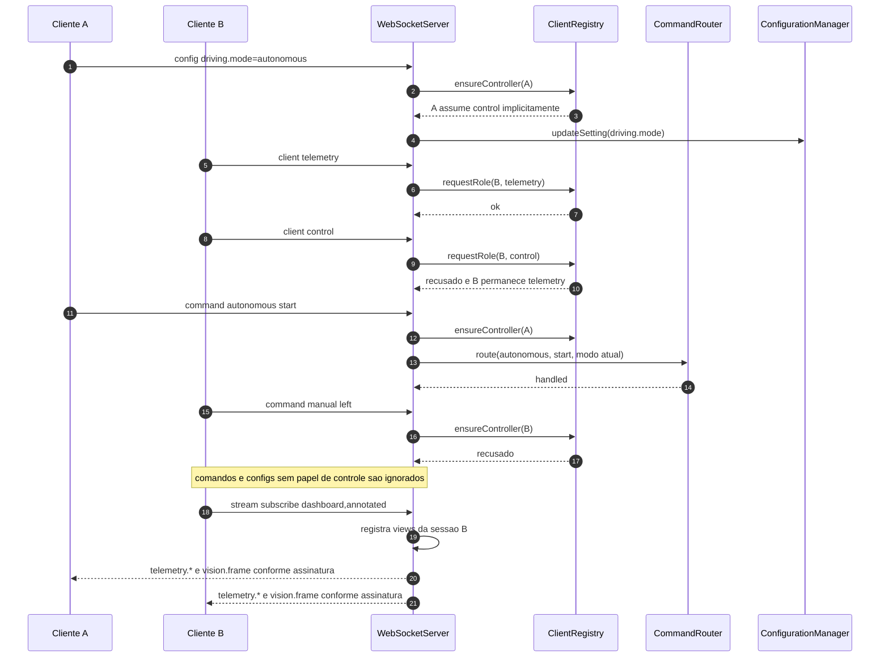
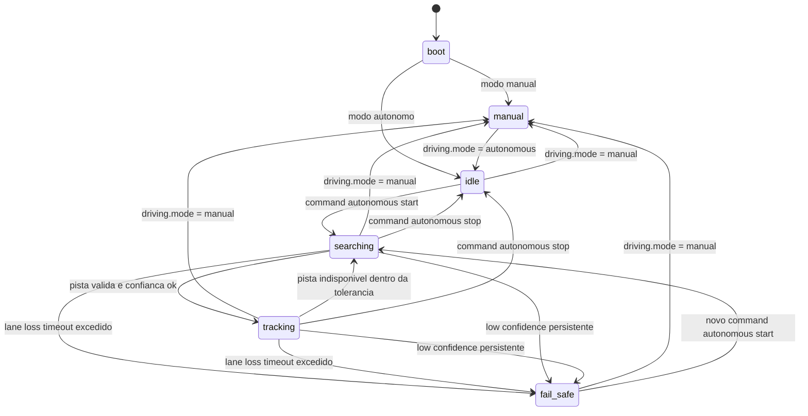
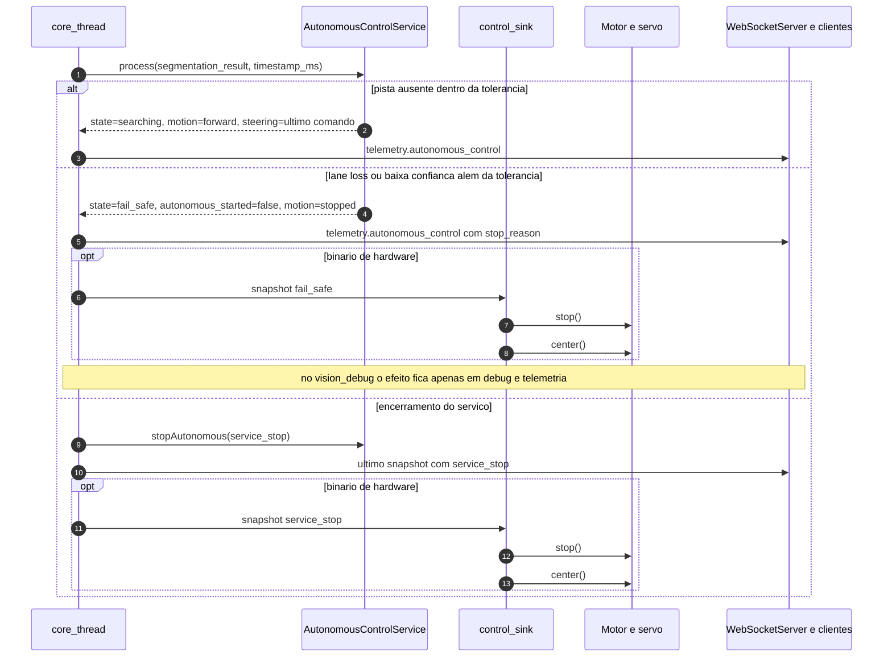

# Operacao do `autonomous_car_v3`

Este documento descreve como a aplicacao opera hoje no Raspberry Pi, tomando o `frontend` e outros clientes WebSocket como interfaces externas. O foco aqui e runtime, concorrencia, fluxo de dados, contratos publicos e comportamento operacional observado no codigo atual.

Base de leitura principal:

- `src/main.cpp`
- `src/vision_debug_main.cpp`
- `src/services/RoadSegmentationService.cpp`
- `src/services/WebSocketServer.cpp`
- `src/services/autonomous_control/AutonomousControlService.cpp`

Fora de escopo:

- versoes antigas `autonomous_car/` e `autonomous_car_v2/`
- arquitetura interna do `frontend`
- planejamento futuro de produto

## Evolucao recente

Os dois ultimos commits alteraram de forma relevante a forma como o sistema opera:

- `1cf3d1d` integrou a deteccao de placas ao servico de visao. A partir daqui o runtime passou a recortar ROI, rodar inferencia Edge Impulse/FOMO, aplicar filtro temporal e publicar `telemetry.traffic_sign_detection`, alem de exibir o resultado no overlay de debug.
- `00909ec` adicionou `telemetry.vision_runtime`, introduziu `LatestValueMailbox` para placas e stream, organizou melhor o fan-out de telemetria/stream e deixou o desacoplamento entre `core`, placas e stream mais explicito. Na pratica, isso reduz o risco de um consumidor lento travar o pipeline principal.

## Visao geral operacional

O `autonomous_car_v3` roda como um processo C++ no Raspberry Pi com dois perfis de execucao:

- `autonomous_car_v3`: perfil de hardware completo, depende de `wiringPi`, registra comandos manuais e aplica comandos autonomos em motor e servo.
- `autonomous_car_v3_vision_debug`: perfil de debug local, nao depende de `wiringPi`, mantem WebSocket, segmentacao, overlays e telemetria, mas nao atua fisicamente no veiculo.

Os dois perfis compartilham o mesmo nucleo de visao:

- `RoadSegmentationService` captura frame, roda segmentacao, alimenta o controle autonomo, dispara a pipeline de placas e faz fan-out de stream/debug.
- `WebSocketServer` recebe comandos/configuracoes e distribui telemetrias/frames.
- `AutonomousControlService` calcula o estado autonomo, o preview error, o PID e o estado de fail-safe.

## Bootstrap e shutdown

O bootstrap varia um pouco entre o binario de hardware e o binario de debug, mas a espinha dorsal e a mesma:

- carregar `autonomous_car.env`
- resolver `vision.env`
- instanciar `AutonomousControlService`
- subir `WebSocketServer`
- subir `RoadSegmentationService`
- aguardar `SIGINT` ou `SIGTERM`
- executar parada segura

No binario de hardware, o processo ainda:

- inicializa `wiringPi`
- cria `MotorController` e `SteeringController`
- registra comandos manuais no `CommandRouter`
- injeta um `control_sink` que aplica `forward/stop` e `setSteering`

No binario `vision_debug`, o controle autonomo existe apenas para telemetria e visualizacao; nao ha atuacao fisica.

## Concorrencia interna

O comportamento atual do runtime e melhor entendido como quatro workers coordenados:

- `core_thread`: prioridade funcional do pipeline, faz captura e segmentacao.
- `traffic_sign_thread`: consome jobs de ROI e roda a deteccao de placas.
- `stream_thread`: renderiza views e serializa `vision.frame` apenas quando existe assinatura.
- `telemetry_thread`: publica telemetrias agregadas e `telemetry.vision_runtime`.

Estruturas de sincronizacao relevantes:

- `LatestValueMailbox<TrafficSignJob>`: guarda apenas o ultimo job de placas.
- `LatestValueMailbox<shared_ptr<CoreFrameSnapshot>>`: guarda apenas o ultimo snapshot para stream/debug.
- `TelemetryTopicQueue`: mantem apenas o ultimo payload por topico de telemetria pendente.

Isso implementa backpressure por descarte controlado. Se a inferencia de placas ou o encode JPEG ficarem lentos, o `core_thread` continua processando frames mais novos sem acumular uma fila infinita.

## Pipeline por frame

O `core_thread` e o ponto mais importante do runtime:

1. le um frame da fonte configurada
2. roda `RoadSegmentationPipeline::process`
3. gera `RoadSegmentationResult`
4. chama `AutonomousControlService::process`
5. produz telemetrias de segmentacao e controle
6. publica snapshot para stream/debug
7. recorta ROI para placas quando essa funcionalidade esta habilitada

Detalhes importantes:

- `near` e `mid` sao obrigatorios para rastreamento autonomo; `far` e opcional.
- o `control_sink` so existe no binario de hardware.
- o stream nao renderiza nada se nao houver `stream:subscribe=*` nem janela local.

## Pipeline de placas

A deteccao de placas esta integrada ao runtime de visao, mas hoje ela ainda e apenas observacional:

- alimenta `telemetry.traffic_sign_detection`
- alimenta overlays de `annotated` e `dashboard`
- nao envia comandos de movimento ou direcao ao veiculo

Fluxo atual:

- o `core_thread` calcula a ROI na lateral direita do frame
- a ROI vira um `TrafficSignJob`
- o `traffic_sign_thread` executa `EdgeImpulseTrafficSignDetector`
- o resultado bruto passa por `TrafficSignTemporalFilter`
- o estado pode ser `disabled`, `idle`, `candidate`, `confirmed` ou `error`
- o resultado mais recente e publicado em telemetria e usado no overlay

`buildRenderableTrafficSignResult()` ainda esconde do overlay resultados muito antigos para evitar que uma deteccao expirada continue aparecendo como atual.

## Protocolo WebSocket

O servidor usa um unico endpoint textual em `ws://0.0.0.0:8080`. Ele acumula tres papeis:

- roteamento de comandos
- aplicacao de configuracoes em runtime
- distribuicao de telemetria e stream de visao

Contrato de sessao:

- existe no maximo um cliente `control`
- clientes adicionais ficam como `telemetry`
- por compatibilidade, a primeira conexao que enviar `command:*` ou `config:*` sem `client:*` previo tenta assumir `control` implicitamente
- assinaturas de stream sao por sessao

### Interfaces publicas de entrada

- `client:control`
- `client:telemetry`
- `command:manual:forward`
- `command:manual:backward`
- `command:manual:stop`
- `command:manual:throttle=<valor>`
- `command:manual:left`
- `command:manual:right`
- `command:manual:center`
- `command:manual:steering=<valor>`
- `command:autonomous:start`
- `command:autonomous:stop`
- `config:driving.mode=manual|autonomous`
- `config:steering.sensitivity=<valor>`
- `config:steering.command_step=<valor>`
- `config:autonomous.pid.kp=<valor>`
- `config:autonomous.pid.ki=<valor>`
- `config:autonomous.pid.kd=<valor>`
- `stream:subscribe=<csv_views>`

Observacao:

- `command:manual:*` so esta ativo no binario de hardware `autonomous_car_v3`
- no binario `autonomous_car_v3_vision_debug`, os comandos ativos sao os de autonomia (`start` e `stop`) e as configuracoes em runtime

### Interfaces publicas de saida

- `telemetry.road_segmentation`
- `telemetry.autonomous_control`
- `telemetry.traffic_sign_detection`
- `telemetry.vision_runtime`
- `vision.frame`

Views suportadas em `vision.frame`:

- `raw`
- `preprocess`
- `mask`
- `annotated`
- `dashboard`

## Controle autonomo

O `AutonomousControlService` usa a segmentacao para manter o veiculo alinhado com a pista. O comportamento detalhado do PID continua documentado em [`pid_control.md`](./pid_control.md), mas operacionalmente o estado atual e:

- `manual`: o roteamento aceita apenas `command:manual:*`
- `idle`: modo autonomo armado, mas ainda sem `start`
- `searching`: autonomia iniciada, mas sem pista valida naquele instante
- `tracking`: pista valida e confianca suficiente
- `fail_safe`: parada segura apos lane loss ou baixa confianca alem da tolerancia

Regras operacionais relevantes:

- `command:autonomous:start` so tem efeito quando `driving_mode=autonomous`
- `command:autonomous:stop` desarma a autonomia
- troca de modo para `manual` reseta PID e para o carro
- nao existe retomada automatica apos `fail_safe`; e preciso novo `command:autonomous:start`

## Degradacao e fail-safe

O fail-safe atual foi desenhado para parar com seguranca sem depender do cliente WebSocket para decidir isso em tempo real.

Casos principais:

- perda de pista por mais tempo que `AUTONOMOUS_LANE_LOSS_TIMEOUT_MS`
- confianca abaixo de `AUTONOMOUS_MIN_CONFIDENCE` acima da tolerancia
- `command:autonomous:stop`
- troca de modo
- encerramento do servico

No binario de hardware, isso chega ate os atuadores. No binario `vision_debug`, o efeito fica restrito a telemetria e overlay.

## Arquivos de configuracao

Responsabilidades dos arquivos carregados no runtime:

- `config/autonomous_car.env`
  - pinos e dinamica de motor
  - centro e limites de direcao
  - `DRIVING_MODE`
  - tuning do PID autonomo
  - limites de fail-safe
- `config/vision.env`
  - origem de captura
  - camera index ou path local
  - habilitacao da janela local
  - `VISION_TELEMETRY_MAX_FPS`
  - `VISION_STREAM_MAX_FPS`
  - `TRAFFIC_SIGN_TARGET_FPS`
  - `VISION_STREAM_JPEG_QUALITY`
  - paths dos arquivos de segmentacao e placas
- `config/road_segmentation.env`
  - parametros `LANE_*` do pipeline compartilhado
- `config/traffic_sign.env`
  - enable/disable de placas
  - definicao da ROI
  - confianca minima
  - filtro temporal de confirmacao e expiracao

## Limites atuais

- o alvo `autonomous_car_v3` depende de `wiringPi`; quando a biblioteca nao existe, esse binario nao e gerado
- sem `wiringPi`, o fluxo suportado e `autonomous_car_v3_vision_debug`
- o stream de visao usa o mesmo WebSocket textual; nao existe endpoint HTTP/MJPEG separado
- a deteccao de placas hoje nao comanda o veiculo; ela alimenta apenas telemetria e overlay

