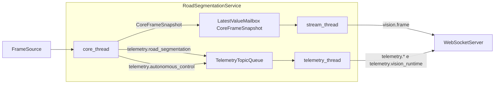

# Operacao do `autonomous_car_v3`

Este documento descreve o runtime atual do `autonomous_car_v3` no Raspberry Pi, com foco em concorrencia, fluxo de dados e contratos WebSocket.

Base de leitura principal:

- `src/main.cpp`
- `src/vision_debug_main.cpp`
- `src/services/RoadSegmentationService.cpp`
- `src/services/WebSocketServer.cpp`
- `src/services/autonomous_control/AutonomousControlService.cpp`

## Estado atual da arquitetura

O Raspberry nao executa mais Edge Impulse nem qualquer pipeline local de deteccao de placas.

Hoje o V3 faz cinco coisas:

1. captura e processa frames para segmentacao de estrada
2. calcula o estado do controle autonomo
3. publica stream de visao (`vision.frame`)
4. publica telemetria local do carro
5. recebe e repassa mensagens de placas vindas de um servico externo

O servico externo de placas:

- assina `vision.frame` na view `raw`
- roda a inferencia fora do Raspberry
- devolve `signal:detected=<signal_id>`
- devolve JSON `telemetry.traffic_sign_detection`

O V3 aceita essas mensagens e:

- registra `signal:detected` no `TrafficSignalRegistry`
- redistribui o payload bruto `telemetry.traffic_sign_detection` para os clientes conectados

## Perfis de execucao

- `autonomous_car_v3`: perfil com `wiringPi`, GPIO e atuacao real em motor/servo
- `autonomous_car_v3_vision_debug`: perfil sem `wiringPi`, usado para debug e telemetria

Os dois compartilham o mesmo nucleo de visao e o mesmo protocolo WebSocket.

## Bootstrap e shutdown

Sequencia de subida:

1. carregar `config/autonomous_car.env`
2. resolver `config/vision.env`
3. instanciar `AutonomousControlService`
4. criar `WebSocketServer`
5. criar `RoadSegmentationService`
6. subir servidor e workers
7. aguardar `SIGINT` ou `SIGTERM`

Sequencia de parada:

1. `stopAutonomous(service_stop)`
2. parar `RoadSegmentationService`
3. parar `WebSocketServer`
4. no binario de hardware, aplicar `motor.stop()` e `steering.center()`

## Concorrencia interna

O runtime atual do `RoadSegmentationService` trabalha com tres frentes paralelas:

- `core_thread`: captura frame, roda segmentacao e atualiza o controle autonomo
- `stream_thread`: renderiza views e serializa `vision.frame` apenas quando ha assinatura ou janela local
- `telemetry_thread`: publica `telemetry.road_segmentation`, `telemetry.autonomous_control` e `telemetry.vision_runtime`

Estruturas de sincronizacao relevantes:

- `LatestValueMailbox<shared_ptr<CoreFrameSnapshot>>`: guarda apenas o snapshot mais recente para o stream
- `TelemetryTopicQueue`: guarda apenas o ultimo payload pendente por topico de telemetria

Essa combinacao preserva o comportamento multi-core e evita backlog infinito quando um consumidor fica mais lento que o produtor.



## Pipeline por frame

O `core_thread` e o caminho critico do runtime:

1. le um frame da fonte configurada
2. executa `RoadSegmentationPipeline::process`
3. gera `RoadSegmentationResult`
4. chama `AutonomousControlService::process`
5. publica telemetrias de segmentacao e controle
6. envia o snapshot mais recente para o `stream_thread`

Detalhes importantes:

- `near` e `mid` continuam sendo as referencias principais para rastreamento autonomo
- o `control_sink` so existe no binario de hardware
- o stream nao renderiza nada se nao houver `stream:subscribe=*` nem janela local

## Debug local

Quando `VISION_DEBUG_WINDOW_ENABLED=true`, o Raspberry abre uma unica janela com:

- painel 2x2 da segmentacao
- painel lateral do controle autonomo
- gauge de steering
- preview top-down da trajetoria

Nao existe mais:

- janela local dedicada para placas
- ROI de placas desenhada no Raspberry
- bounding boxes de placas desenhadas no stream do Raspberry

## WebSocket

Servidor padrao:

```text
ws://0.0.0.0:8080
```

### Entrada

Mensagens aceitas:

- `client:control`
- `client:telemetry`
- `command:<origem>:<acao>`
- `config:<chave>=<valor>`
- `stream:subscribe=<csv_views>`
- `signal:detected=<signal_id>`
- payload JSON `telemetry.traffic_sign_detection`

Regras:

- `command:` e `config:` continuam exigindo sessao `control`
- `signal:` nao exige sessao `control`
- JSON `telemetry.traffic_sign_detection` tambem nao exige sessao `control`
- o servidor nao interpreta semanticamente o JSON de placas; ele apenas valida o tipo e redistribui o payload bruto

### Saida

O V3 publica:

- `telemetry.road_segmentation`
- `telemetry.autonomous_control`
- `telemetry.vision_runtime`
- `vision.frame`
- `telemetry.traffic_sign_detection` apenas como relay de mensagens externas

### Contrato de runtime

`telemetry.vision_runtime` manteve os campos ligados a placas para nao quebrar o frontend, mas eles ficam neutros porque nao ha inferencia local:

- `traffic_sign_fps = 0`
- `traffic_sign_inference_ms = 0`
- `traffic_sign_dropped_frames = 0`
- `sign_result_age_ms = -1`

Esse comportamento e intencional: compatibilidade de payload sem reintroduzir logica de placas no Raspberry.

## Stream para o `traffic_sign_service`

O V3 continua sendo a fonte de frames do servico externo:

1. o `traffic_sign_service` conecta como `client:telemetry`
2. envia `stream:subscribe=raw`
3. recebe `vision.frame` da view `raw`
4. processa a inferencia fora do Raspberry
5. devolve `signal:detected` e `telemetry.traffic_sign_detection`

Esse fluxo permite manter o Raspberry mais limpo e focado no controle do veiculo.

## Arquivos de configuracao relevantes

- `config/autonomous_car.env`: hardware e tuning do controlador
- `config/vision.env`: origem de captura, stream e janela local
- `config/road_segmentation.env`: parametros da segmentacao

Nao existe mais `config/traffic_sign.env` no `autonomous_car_v3`.

## Testes que cobrem o runtime novo

Os testes ativos cobrem:

- serializacao de `telemetry.vision_runtime`
- carga do `vision.env` simplificado
- `RoadSegmentationService` sem pipeline local de placas
- relay de `telemetry.traffic_sign_detection` no `WebSocketServer`
- manutencao do canal `signal:detected`

Comandos:

```bash
cmake -S . -B build
cmake --build build --parallel
cd build
ctest --output-on-failure
```
